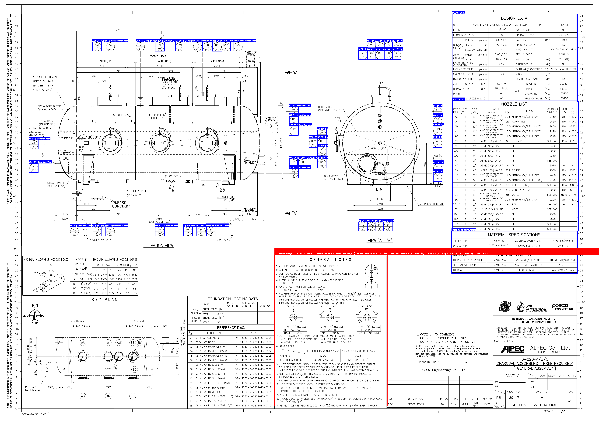
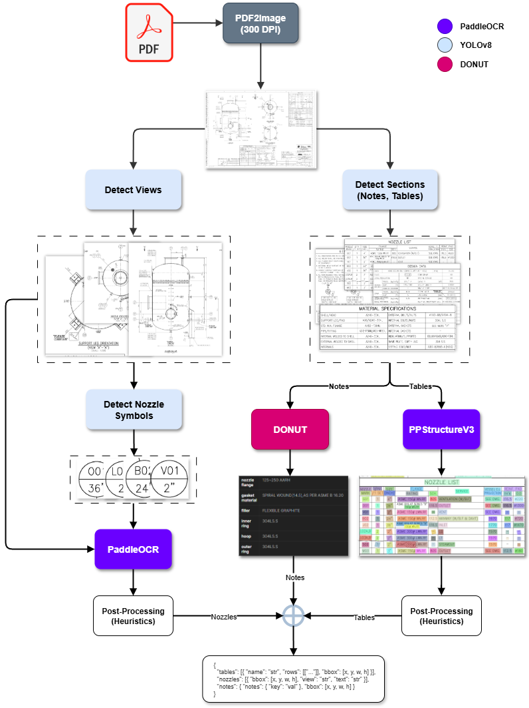

# GA Drawing Analysis

## Description
Analyze GA (General Arrangement) Drawings using state-of-the-art deep learning models for automated detection and extraction of tables, nozzles, notes, and views.



## Tech Stack
- **YOLOv8 (nano):** For cropping regions of interest (notes, tables, nozzles, views)  
- **PaddleOCR (OCR + PPStructureV3):** For parsing tables and nozzle symbols with high accuracy  
- **DONUT:** Transformer-based model for extracting handwritten/typed notes from images

## Resources
- **GPU:** RTX 4070 Ti (12GB VRAM)  
- **CPU:** Intel Core i9-14900KF (24 cores, 32 threads)  
- **RAM:** 64GB  

> **Note:** All models currently run on CPU. (Takes ~30 Seconds per image)

## Methodology



| Task                            | Training Images (after augmentation) | Validation Images | Resolution | mAP50  | mAP   | Notes/Dice (ED) |
|--------------------------------|-------------------------------------|-------------------|------------|--------|-------|-----------------|
| YOLOv8n - Notes & Tables        | 33 (from 11)                        | 1                 | 2048       | 99.5%  | 93.9% |                 |
| YOLOv8 - Views Detection        | 33 (from 11)                        | 1                 | 1536       | 99.5%  | 95.1% |                 |
| YOLOv8 - Nozzles Detection      | 40                                 | 2                 | 1024       | 96%    | 85%   |                 |
| DONUT - Notes Extraction        | 11 (runtime augmentations)          | 1                 | 1280        |        |       | ED: 0.031       |

## Output JSON Schema

```
{
  "tables": [{ "name": "str", "rows": [["..."]], "bbox": [x, y, w, h] }],
  "nozzles": [{ "bbox": [x, y, w, h], "view": "str", "text": "str" }],
  "notes": { "notes": { "key": "val" }, "bbox": [x, y, w, h] }
}
```

## Setup Instructions

1. Clone the repository:
    ```bash
    git clone https://www.github.com/acen20/ga-analysis
    cd ga-analysis
    ```

    Download `det_models/` and `ocr_model/` from [Google Drive Folder](https://drive.google.com/drive/folders/1KVx35KErulzlbqunYOW1U2QssBnUf6O0?usp=sharing)

2. Download YOLOv8 checkpoint files and place them in the `det_models/` directory:  
    ```
    det_models/
    ├── view/
    │   └── best.pt
    ├── section/
    │   └── best.pt
    └── nozzle/
        └── best.pt
    ```

3. Download DONUT checkpoint files and place them in the `ocr_model/` directory:  
    ```
    ocr_model/
    └── {all extracted files here}
    ```

4. Build and start the containers:
    ```bash
    docker-compose up --build
    ```

5. Access the API endpoint:  
    ```
    http://localhost:8000/detect
    ```
> **Note:** First Startup takes time as PaddleOCR downloads OCR models
---

## Usage

- The API will be exposed at:  
  `http://localhost:8000/detect`

- Send a POST request with the pdf_file file to the endpoint to get detections and extracted info.

### Example Request (using `curl`):

```bash
curl -X POST "http://localhost:8000/detect" \
  -F "file=@path/to/your/file.pdf"
```


## Limitations

1. **Limited Dataset Size**  
   With only 12 documents available for training/testing, the model may not generalize well to variations in document structure, terminology, or formatting.

2. **Edge Case – Split Notes Section**  
   In some cases, the *Notes* section is split into two parts across the document. This was not detected due to the lack of such variations in the dataset.  
   - Potential fix: Oversample relevant cases to train for this pattern. This can be attempted in future iterations.

3. **Complex Table Structures**  
   Some table layouts are too complex for PaddleOCR’s `PPStructureV3` to accurately distinguish cell boundaries. A more sophisticated table parsing strategy is required for improved accuracy.
